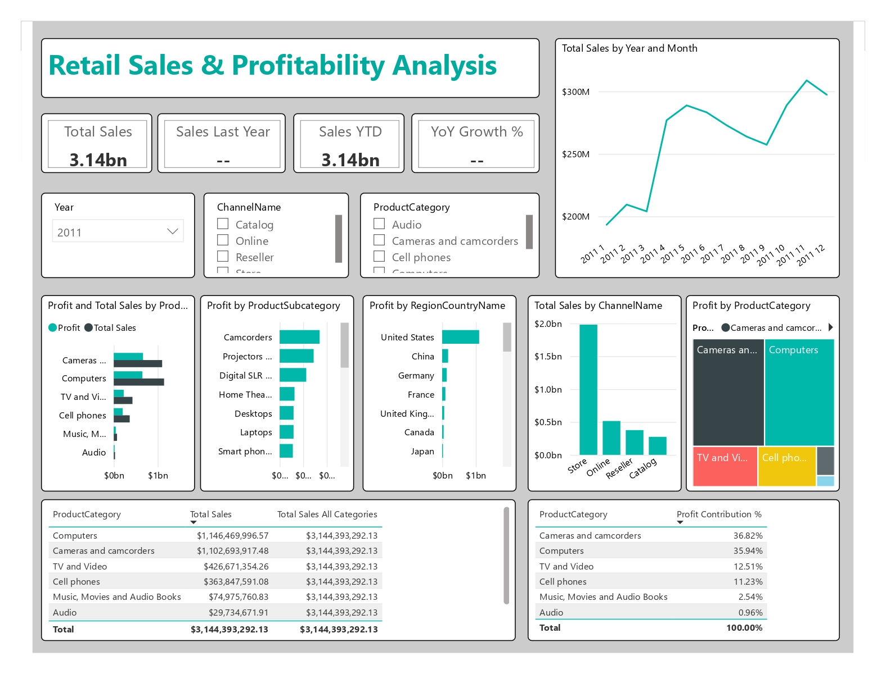
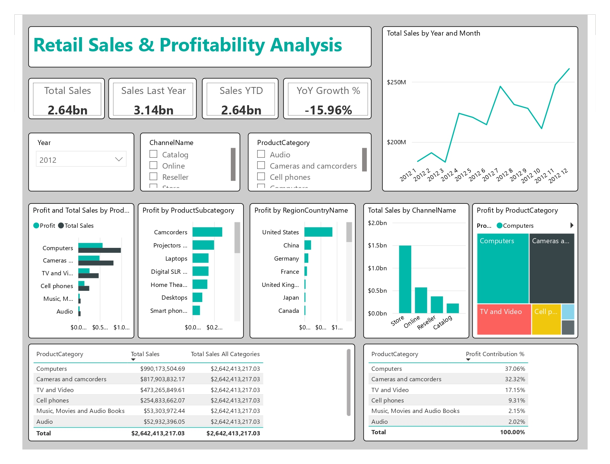
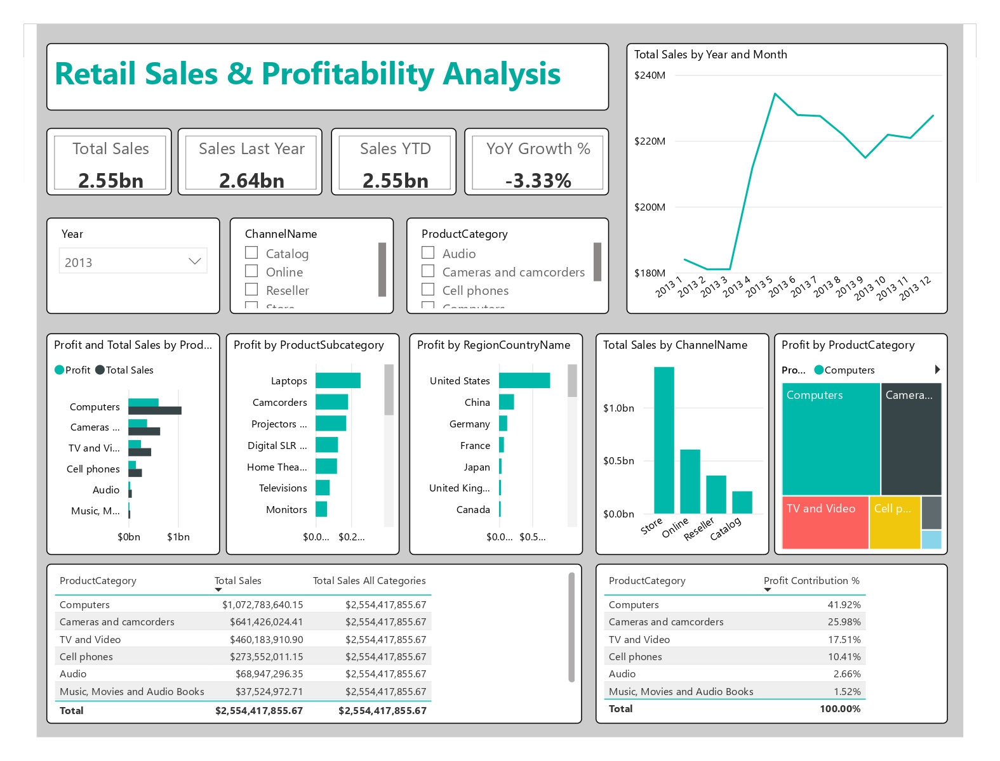

# Retail Sales & Profitability Analysis Dashboard

## Project Overview

This Power BI dashboard analyzes retail sales performance, profitability, product categories, sales channels, and regional contributions using the Contoso Retail Sales dataset.

The dashboard provides interactive filtering and KPI tracking to help understand sales trends and business performance over time.

---

## Dashboard Screenshots

### Year 2011

### Year 2012

### Year 2013

---

## Key KPIs

- Total Sales
- Sales Last Year
- Sales YTD
- Year-over-Year (YoY) Growth %

---

## Dashboard Features

### Sales Analysis
- Monthly Sales Trend
- Sales by Product Category
- Sales by Channel

### Profitability Analysis
- Profit by Product Category
- Profit by Product Subcategory
- Profit Contribution %

### Geographic Analysis
- Profit by Country/Region

### Interactive Filters
- Year
- Product Category
- Channel Name

---

## Tools & Technologies

- Power BI Desktop
- DAX
- Power Query
- Data Modeling

---

## DAX Measures

### Total Sales
Total Sales = SUM(Sales[SalesAmount])

### Sales Last Year
Sales Last Year =
CALCULATE(
    [Total Sales],
    SAMEPERIODLASTYEAR(DateTable[Date])
)

### Sales YTD
Sales YTD =
TOTALYTD(
    [Total Sales],
    DateTable[Date]
)

### YoY Growth %
YoY Growth % =
DIVIDE(
    [Total Sales] - [Sales Last Year],
    [Sales Last Year]
)

## Business Insights
•	Store channel generates the highest sales.

•	Computers consistently contribute the largest share of sales and profit.

•	The United States is the most profitable region.

•	Product category performance changes across years.

•	Sales trends show seasonal fluctuations throughout the year. 

## Dataset

Dataset: Microsoft Contoso Retail Sales Sample Dataset

## Author
Shahzaib Ali

Data Analyst | SQL | Power BI

